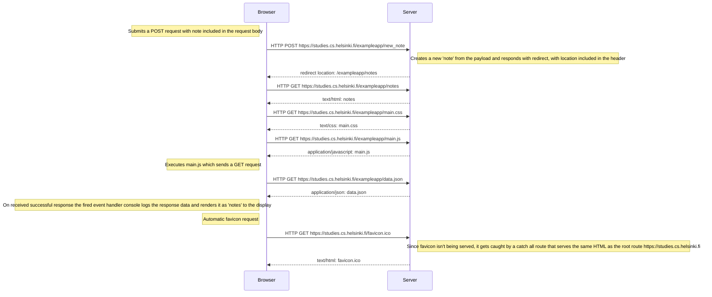

# 0.4: New note

```mermaid
sequenceDiagram
    participant Browser
    participant Server
    Note left of Browser: Submits a POST request with note included in the request body
    Browser->>Server: HTTP POST https://studies.cs.helsinki.fi/exampleapp/new_note
    Note right of Server: Creates a new 'note' from the payload and responds with redirect, with location included in the header
    Server-->>Browser: redirect location: /exampleapp/notes
    Browser->>Server: HTTP GET https://studies.cs.helsinki.fi/exampleapp/notes
    Server-->>Browser: text/html: notes
    Browser->>Server: HTTP GET https://studies.cs.helsinki.fi/exampleapp/main.css
    Server-->>Browser: text/css: main.css
    Browser->>Server: HTTP GET https://studies.cs.helsinki.fi/exampleapp/main.js
    Server-->>Browser: application/javascript: main.js
    Note left of Browser: Executes main.js which sends a GET request
    Browser->>Server: HTTP GET https://studies.cs.helsinki.fi/exampleapp/data.json
    Server-->>Browser: application/json: data.json
    Note left of Browser: On received successful response the fired event handler console logs the response data and renders it as 'notes' to the display
    Note left of Browser: Automatic favicon request
    Browser->>Server: HTTP GET https://studies.cs.helsinki.fi/favicon.ico
    Note right of Server: Since favicon isn't being served, it gets caught by a catch all route that serves the same HTML as the root route https://studies.cs.helsinki.fi
    Server-->>Browser: text/html: favicon.ico
```
