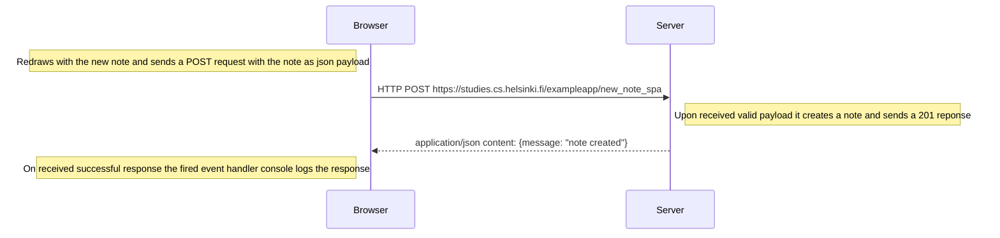

# 0.6: New note (spa)

```mermaid
sequenceDiagram
    participant Browser
    participant Server
    Note left of Browser: Redraws with the new note and sends a POST request with the note as json payload
    Browser->>Server: HTTP POST https://studies.cs.helsinki.fi/exampleapp/new_note_spa
    Note right of Server: Upon received valid payload it creates a note and sends a 201 reponse
    Server-->>Browser: application/json content: {message: "note created"}
    Note left of Browser: On received successful response the fired event handler console logs the response
```
